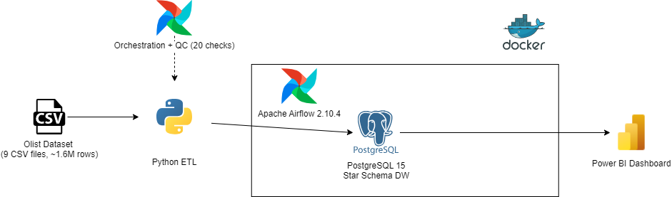
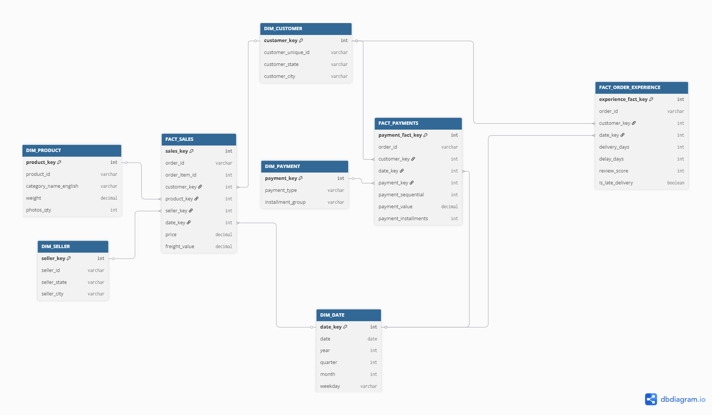
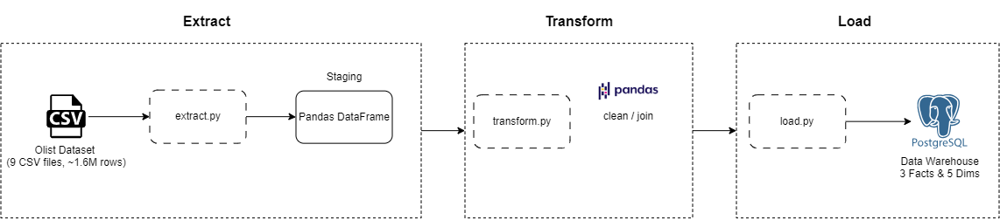
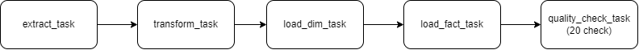
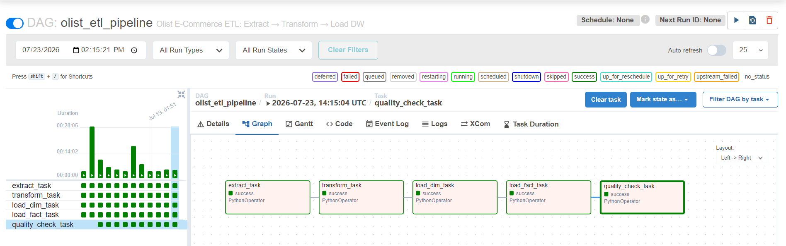
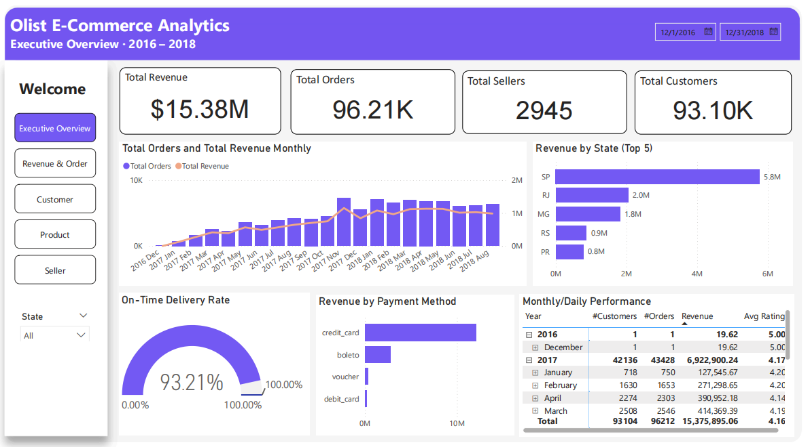
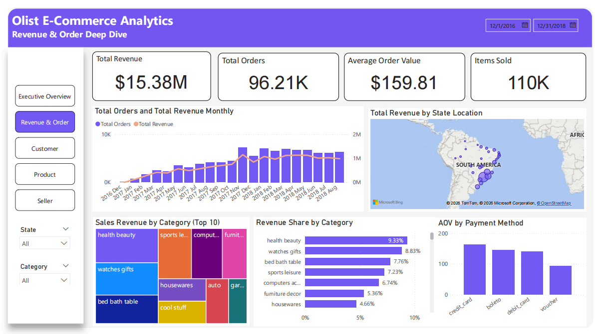
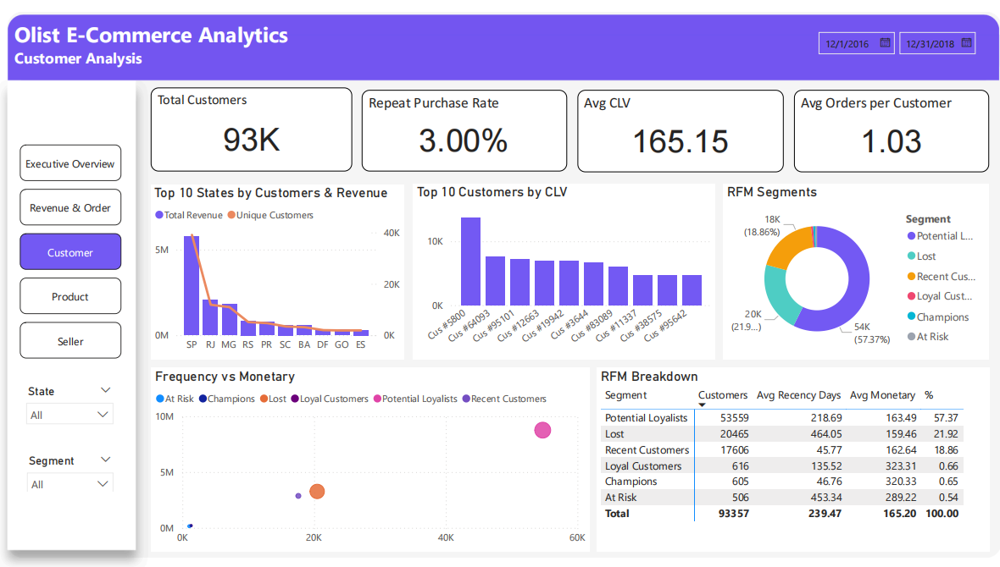
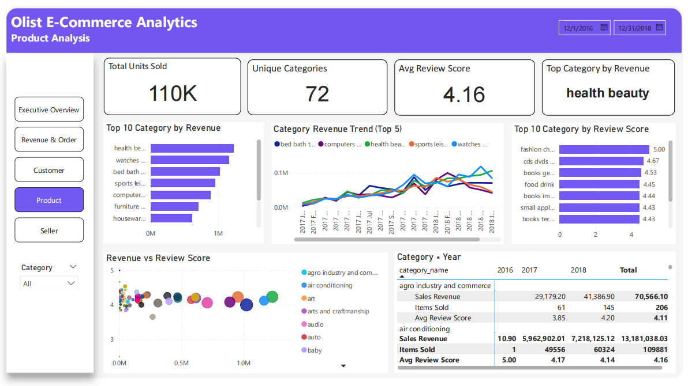
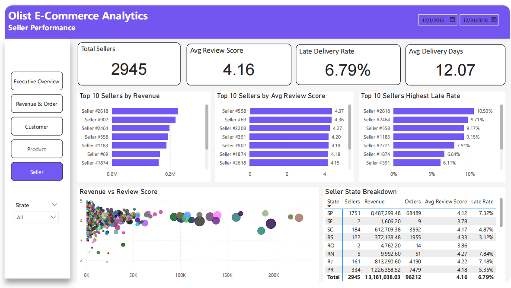

# E-commerce Data Warehouse & Analytics Platform

> **Olist Brazilian E-Commerce** | Python · PostgreSQL · Apache Airflow · Docker · Power BI

---

## Business Problem

Olist, a Brazilian e-commerce marketplace, needs a centralized analytics platform to answer questions across sales performance, customer behavior, seller effectiveness, payment preferences, and logistics operations.

This project builds a production-ready Data Warehouse with a fully automated ETL pipeline and BI dashboards covering **17 business questions** across 5 analytical domains.

---

## Architecture



---

## Data Modeling

**Star Schema — Kimball Methodology**



### 3 Fact Tables

| Fact Table | Grain | Key Measures |
|---|---|---|
| `FACT_SALES` | 1 product in 1 order | price, freight_value |
| `FACT_PAYMENTS` | 1 payment record | payment_value, payment_installments |
| `FACT_ORDER_EXPERIENCE` | 1 order | delivery_days, delay_days, review_score |

> **Why 3 fact tables?** A single fact table with `payment_value` at order-item grain causes fan-out join — `SUM(payment_value)` double-counts when an order has multiple items.

### 5 Dimension Tables

| Dimension | Source | Key Column |
|---|---|---|
| `DIM_CUSTOMER` | customers | `customer_unique_id` |
| `DIM_PRODUCT` | products + category_translation | `product_id` |
| `DIM_SELLER` | sellers | `seller_id` |
| `DIM_DATE` | generated | `date_key` (YYYYMMDD) |
| `DIM_PAYMENT` | order_payments | `payment_type` |

> **Note:** `customer_id` in Olist is a per-order surrogate, **not** a person identifier. All fact tables use `customer_unique_id` (via `DIM_CUSTOMER`) as the true person-level key.

---

## ETL Pipeline

### Stack
- **Python 3.12** — pandas, SQLAlchemy, psycopg2
- **PostgreSQL 15** — running in Docker
- **Apache Airflow 2.10.4** — orchestration


### Airflow DAG




### Idempotency Strategy

All loads use **UPSERT (ON CONFLICT DO UPDATE)** on natural keys:

| Table | Natural Key |
|---|---|
| `FACT_SALES` | `(order_id, order_item_id)` |
| `FACT_PAYMENTS` | `(order_id, payment_sequential)` |
| `FACT_ORDER_EXPERIENCE` | `order_id` |
| `DIM_CUSTOMER` | `customer_unique_id` |
| `DIM_PRODUCT` | `product_id` |

Running the pipeline multiple times produces **identical row counts** — no duplicates created.

### Data Quality Checks (20 checks)

| Category | Checks | Examples |
|---|---|---|
| Completeness | 5 | fact tables not empty |
| Validity | 6 | price > 0, review_score 1–5 |
| Nullability | 3 | customer_key, product_key not null |
| Uniqueness | 2 | no duplicate natural keys |
| Referential Integrity | 3 | FK between fact and dim |
| Date Range | 1 | dim_date covers 2016–2018 |

All 20 checks **PASS** on the Olist dataset.

---

## Setup & Running

### Prerequisites
- Docker Desktop
- Python 3.10+

### Quick Start

```bash
# 1. Clone repo
git clone https://github.com/doxuantu110/ecommerce-data-warehouse-and-analytics-platform.git
cd ecommerce-data-warehouse-and-analytics-platform

# 2. Download Olist dataset from Kaggle
# https://www.kaggle.com/datasets/olistbr/brazilian-ecommerce
# Place CSV files in data/raw/

# 3. Configure environment
cp .env.example .env
# Edit .env with your passwords

# 4. Generate Airflow keys
python -c "from cryptography.fernet import Fernet; print(Fernet.generate_key().decode())"
python -c "import secrets; print(secrets.token_hex(32))"
# Add to .env as AIRFLOW_FERNET_KEY and AIRFLOW_SECRET_KEY

# 5. Start containers
docker compose build
docker compose up -d

# 6. Wait ~2 minutes, then open Airflow UI
# http://localhost:8080  (admin / admin)

# 7. Create PostgreSQL connection in Airflow UI
# Admin → Connections → +
# Conn Id: postgres_olist_dw | Type: Postgres
# Host: postgres | Schema: olist_dw | Login: olist_user | Port: 5432

# 8. Trigger ETL pipeline
# DAGs → olist_etl_pipeline → ▶ Trigger
```

### Run ETL without Airflow (standalone)

```bash
cd etl/
pip install -r requirements.txt
python load.py
```

---

## Project Structure

```
ecommerce-data-warehouse-and-analytics-platform/
├── airflow/
│   ├── Dockerfile
│   ├── requirements.txt
│   └── dags/
│       └── etl_dag.py
├── data/
│   └── raw/                   
├── etl/
│   ├── extract.py
│   ├── transform.py
│   ├── load.py
│   └── generate_dim_date.py
├── sql/
│   ├── create_dw.sql           # Star schema DDL
│   ├── create_airflow_db.sh    # Init script for airflow_db
│   ├── analytics_queries.sql   # 21 analytics queries (17 BQs)
│   └── data_quality_checks.sql # 20 DQ checks
├── notebooks/
│   └── data_exploration_v3.ipynb
├── dashboard/
│   └── olist_ecommerce_dashboard.pbix
├── docs/
│   ├── business_questions.md
│   ├── star_schema.png
│   ├── dag_graph.png
│   └── airflow_setup.md
├── docker-compose.yml
├── .env.example
├── .gitignore
└── README.md
```

---

## Dataset

**Olist Brazilian E-Commerce** — [Kaggle](https://www.kaggle.com/datasets/olistbr/brazilian-ecommerce)

| Table | Rows |
|---|---|
| customers | 99,441 |
| orders | 99,441 |
| order_items | 112,650 |
| order_payments | 103,886 |
| order_reviews | 99,224 |
| products | 32,951 |
| sellers | 3,095 |
| geolocation | 1,000,163 |

**Date range:** September 2016 – August 2018

---

## Known Data Issues (Olist Source)

| Issue | Count | Resolution |
|---|---|---|
| `payment_value = 0` (voucher) | 4 rows | Valid — voucher covers full order |
| `credit_card installments = 0` | 2 rows | Source anomaly, excluded from QC |
| `delivery_days = 0` | 13 rows | Timestamp precision artifact |

---

## Data Warehouse

- Star Schema designed (3 facts, 5 dims)
- PostgreSQL DW created via `create_dw.sql`
- ETL pipeline: extract → transform → load (idempotent)
- `dim_date` auto-populated (1,096 rows, 2016–2018)
- 21 analytics SQL queries covering all 17 Business Questions

**Final row counts:**

| Table | Rows |
|---|---|
| dim_customer | 96,096 |
| dim_product | 32,951 |
| dim_seller | 3,095 |
| dim_date | 1,096 |
| fact_sales | 110,197 |
| fact_payments | 100,756 |
| fact_order_experience | 96,470 |

---

## Airflow Orchestration

- Apache Airflow 2.10.4 running in Docker (separate `airflow_db`)
- ETL DAG with 5 tasks: `extract → transform → load_dim → load_fact → quality_check`
- PostgresHook for secure DB connection (no hardcoded credentials)
- Idempotent UPSERT — pipeline safe to re-run at any time
- 20 Data Quality checks — all PASS
- Retry mechanism: `retries=3`, `retry_delay=5min`
- Structured logging with timing per task

**Pipeline timing (full run):**

| Task | Duration |
|---|---|
| extract_task | ~6s |
| transform_task | ~10s |
| load_dim_task | ~52s (2nd run, UPSERT) |
| load_fact_task | ~3 min (1st run) |
| quality_check_task | ~3s |


---
## Dashboard

**Tool:** Power BI Desktop  
**Connection:** PostgreSQL DW (localhost:5432/olist_dw)  
**File:** `dashboard/ecommerce_dashboard.pbix`

### 5 Pages

| Page | Business Questions | Key Visuals |
|---|---|---|
| Executive Overview | BQ #1, #3, #9, #10 | KPI cards, Revenue trend, Revenue by state, Payment methods |
| Revenue & Order | BQ #1, #2, #3, #10, #11 | Category revenue, YoY growth, AOV by state |
| Customer | BQ #4, #5, #6, #9 | CLV top 20, RFM segments, Scatter F×M |
| Product | BQ #2, #17 | Category revenue, Review by category, Revenue×Review scatter |
| Seller | BQ #7, #8 | Top sellers, Late delivery rate, Revenue×Review scatter |

### Screenshots







## Future Improvements

- **dbt Core** — refactor transform layer with staging/intermediate/marts + dbt tests
- **Incremental load** — detect new orders by `updated_at` timestamp instead of full reload
- **CI/CD** — GitHub Actions to lint DAGs and run DQ checks on PR
- **Cloud deployment** — migrate to GCP (Cloud Composer + BigQuery) or AWS (MWAA + Redshift)
